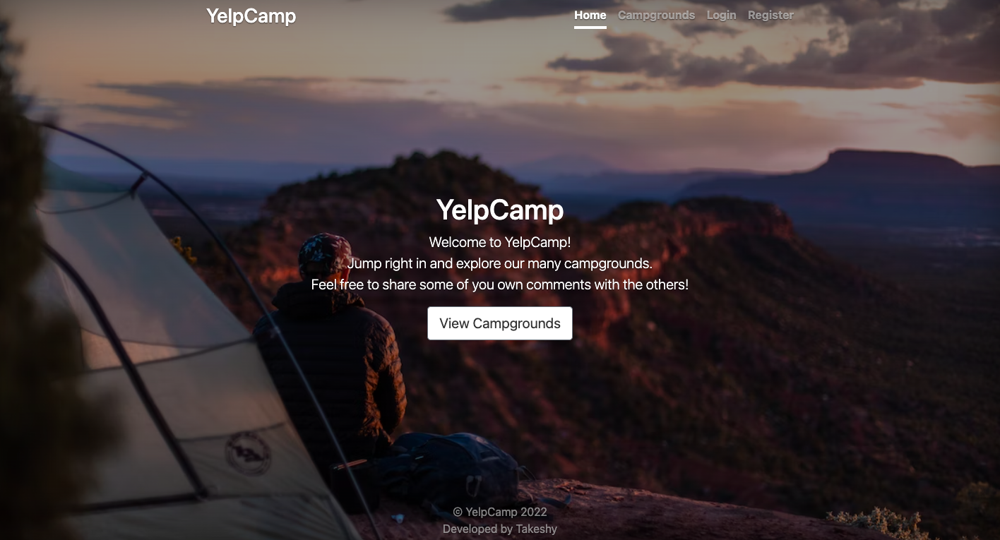

# Yelp-Campground

## Table of contents

- [Overview](#overview)
  - [Project goal](#project-goal)
  - [Screenshot](#screenshot)
  - [Links](#links)
- [My process](#my-process)
  - [Built with](#built-with)
  - [What I learned](#what-i-learned)
  - [Useful resources](#useful-resources)

## Overview

### Project goal

Users should be able to:

- View the website on various devices and move between the sections of the app smoothly.
- See others' campground and reviews but to interact with them they need to be logged in.
- Sign up or login on the website directly or via their google account.
- Add location on the map by just adding a new campground and specify the location of it.

### Screenshot

### Links

- Live Site URL: [Yelp-Campground](yelp-campground.vercel.app/)

## My process

### Built with

- Semantic HTML5 markup
- CSS custom properties
- Node.js
- Express.js
- EJS
- Mongoose
- MongoDB
- Cloudinary
- Mapbox
- Passport
- Npm

- [Node.js](https://nodejs.org/en/) - To establish a server with JS
- [Express](https://expressjs.com/) - Web framework for Node.js
- [EJS](https://ejs.com/) - Embedded javaScript templating
- [MongoDB](https://mongoosejs.com/) - Database
- [Cloudinary](https://cloudinary.com/) - Database for pictures
- [Mapbox](https://mapbox.com) - To show the all maps in app
- [Passport](http://www.passportjs.org/) - All sort of authentication 
- [Npm](https://www.npmjs.com/) - Npm packages 

### What I learned

- How to create a website with server and database using node.js for the server and express to handle the requests and the responses also to manage static files in public folder, and with EJS I was able to using javascript inside html files.
- And how to save the data in the database like mongodb, and cloudinary as a database for pics due to its size.
- Besides, mapbox website to show maps on the app and to manage to provide geolocation features.
- Also implemented many packages via npm to save time, keep it simple, and efficient.
- How to use passport for authentication whether locally or with google.
- Finally to organize the app with controllers instead of putting everything in one place and to achieve MVC.

### Useful resources

- [cookie-parser](https://www.npmjs.com/package/cookie-parser) - This helped me for managing the cookies of the session, to keep the user logged in even after closing the browser.
- [method-override](https://www.npmjs.com/package/method-override) - This is an amazing package which helped me to control DELETE and PUT requests easily. I'd recommend it to anyone want to handle those requests.
- [HELMET](https://helmetjs.github.io/) - This tool assisted me keep the website secure, it's a a huge bullet for security but it can help.
- [connect-flash](https://www.npmjs.com/package/connect-flash) - This is a small tool to control the messages on the website as a pop up or notification, and it can be manipulated to handle all sort of alerts.

